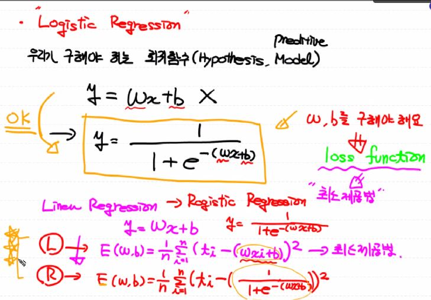
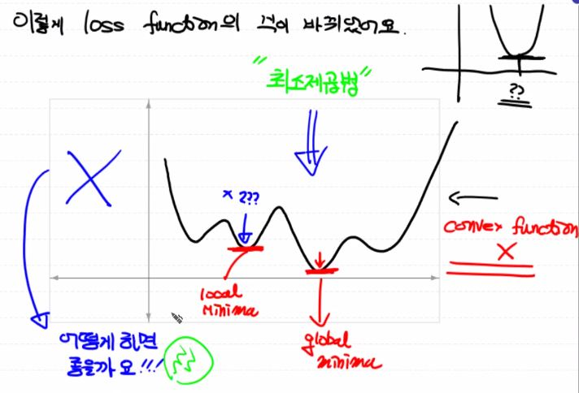
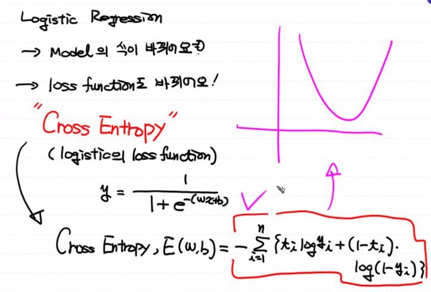

## Logistic Regression

* 지금까지는 선형 회귀였지만 다른 회귀에 대해 알아보자.

* 보통 Machine learning에는 regression과 classification이 있다.

* Classification은 정확도 측정이 가능하며 training data의 특성과 분포를 파악한 후 미지의 입력 데이터에 대해 어떤 종류의 값으로 분류될 수 있는지 예측한다.

* Classification 구현을 위해서는 많은 알고리즘이 있다. (SVM, Naive Bayse ...) 이번에는 logistic regression에 대해 알아보자

  * logistic regression은 정확도가 상당히 높다.
  * Deep learning의 기본 component로 활용된다.

* 동작방식은 Linear Regression을 이용해서 training data set의 특성과 분포를 파악해서 직선을 찾는다. (2차원 대상, 3차원은 평면/ 4차원은 초평면 ...)

* 그 직선을 기준으로 데이터를 분류한다. (0 or 1)

* 다만 분류(classification)작업을 하기에 문제가 있다. (직선이기 때문에 문제가 된다)

  => 이를 해결하기 위해 Sigmoid 함수 (S 모양의 곡선으로 변환)을 도입한다.



* 위는 sigmoid 함수를 나타낸다. 그렇다면 최소제곱법은 저렇게 나타내진다. 하지만



* Sigmoid 함수를 최소제곱법으로 활용하면 W값에 따라 local minimum이 걸릴 수 있다. 이를 해결하기 위해서 Cross Entropy를 활용한다.


### tensorflow를 이용한 구현

```python
import tensorflow as tf
import numpy as np

# training data set
x_data = np.array([[1,0],
                  [2,0],
                  [5,1],
                  [2,3], 
                  [3,3],
                  [8,1],
                  [10,0]])

t_data = np.array([[0],
                   [0],
                   [0],
                   [1],
                   [1],
                   [1],
                   [1]])

# placeholder
X = tf.placeholder(shape=[None,2], dtype=tf.float32)
T = tf.placeholder(shape=[None,1], dtype=tf.float32)

# Weight & bias
W = tf.Variable(tf.random.normal([2,1]), name='weight')
b = tf.Variable(tf.random.normal([1]), name='bias')

# Hypothesis(Logistic Model)
logits = tf.matmul(X,W) + b     # Linear Regression Hypothesis
H = tf.sigmoid(logits)

# loss function
loss = tf.reduce_mean(tf.nn.sigmoid_cross_entropy_with_logits(logits=logits, labels=T))

######### Linear Regression에서 사용했던 코드 그대로 사용!
# train node 생성
train = tf.train.GradientDescentOptimizer(learning_rate=0.001).minimize(loss)

# Session & 초기화
sess = tf.Session()
sess.run(tf.global_variables_initializer())

# 학습을 진행
for step in range(30000):
    _,W_val,b_val,loss_val = sess.run([train,W,b,loss], feed_dict={X : x_data, T : t_data})
    
    if step % 3000 == 0 :
        print('w:{},b:{},loss:{}'.format(W_val,b_val,loss_val))
    
# 예측 !!
print(sess.run(H, feed_dict={X : [[4,2]] }))
```

