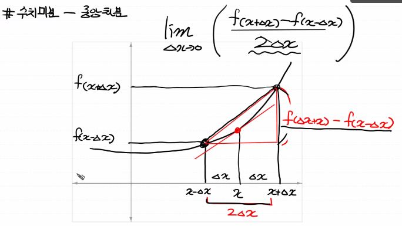
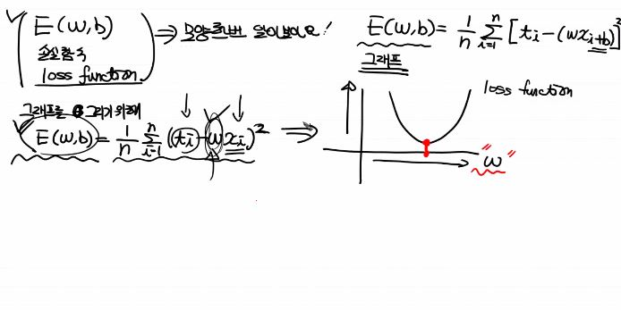

# Machine Learning


## Machine Learning Introduction

먼저 3가지 용어부터 정리하자

* AI (Artificial Intelligence) : 인간이 가지고 있는 학습능력, 응용력, 추론능력을
  컴퓨터를 통해서 구현하고자 하는 가장 포괄적인 개념

* Machine Learning : AI를 구현하는 하나의 방법론. 데이터를 이용해서 데이터의 특성과 패턴을 학습하고 
  그 결과를 바탕으로 미지의 데이터에 대한 미래결과를 예측하는 프로그래밍 기법
  이런 Machine Learning을 구현하기 위한 방법
  Regression, SVM(Support Vector Machine), Random Forest, Decision Tree,
  Neural Network(신경망), Clustering, Reinforcement Learning 등등등...

* Data Mining :데이터간의 상관관계나 새로운 속성(feature)을 찾는 것이 주 목적인 작업

* Deep Learning : Machine Learning의 한 부분, Neural Network를 이용해서 학습하는 알고리즘의 집합
  (CNN, RNN, LSTM, GAN, ...)


### 그렇다면 Machine Learning이 왜 필요할까 ??

Machine Learning이라는 개념은 1960년대 개념이 만들어졌다. 
Machine Learning은 Explicit program의 한계때문에 고안되었다.
Explicit program은 rule based program이라고 한다. 이런 Explicit program을 이용하면 왠만한 프로그램은 다 구현이 가능하다. 그런데 Explicit programming으로 할 수 없는 프로그램들이 있다.
Rule이 너무 많아서 즉, 조건이나 규칙이 너무 많아서 프로그램으로 표현하기 힘든거다.

* 예1) 스팸메일을 걸러주는 필터프로그램 -> 대출이라는 글자를 찾아서 메일을 spam처리하는 경우 -> 대~출은 못거름
  => 대~출을 등록 => 대^^출은 못 거름 .... => 프로그램으로 만들기 어렵다.
* 예2) 자율주행시스템 => 너무 많은 조건을 생각해서 차량을 운행해야 하기 때문에 어렵다.
* 예3) 바둑 

Explicit 프로그램의 한계때문에 Machine Learning 개념이 1960년대에 도입 되었다.
Machine Learning : 프로그램 자체가 데이터를 기반으로 학습을 통해 배우는 능력을 가지는 프로그램을 지칭


Machine Learning의 Type

Machine Learning은 학습방법에 따라서 크게 4가지로 분류 !!
- 지도학습 (Supervised Learning)
- 비지도학습 (Unsupervised Learning)
- 준지도학습 (SemiSupervised Learning)
- 강화학습 (Reinforcement Learning)

이 4개중에 우리가 관심이 있어하는 학습방법은 지도학습 (Supervised Learning)
우리가 해결해야 하는 현실세계의 대부분의 문제가 지도학습문제

### - 지도학습 (Supervised Learning) - classification algorithm
지도학습은 학습에 사용되는 데이터(data)와 그 정답(label)을 이용해서
데이터의 특성과 분포를 학습하고 미래 결과를 예측하는 방법.

지도 학습은 어떤 종류의 미래값을 예측하느냐에 따라
Regression (회귀)
Classification (분류) - binary classification
                      - multinomial classification

### - 비지도학습 (Unsupervised Learning) - clustering algorithm
비지도학습은 학습에 사용되는 데이터는 ... label이 없는 데이터가 사용된다. 이 부분이 지도학습과의 차이
비지도학습은 정답(label)이 없는 데이터만을 이용하기 때문에 입력값 자체가 가지고 있는 특성과 분포를 
이용해서 Grouping하는 Clustering(군집화)하는데 사용된다.

### - 준지도학습 = 지도학습 + 비지도학습
데이터의 일부분만 label이 제공되는 경우

### - 강화학습 = 위에서 말한 3가지 방식과는 완전히 다른 학습 방법
Agent, Environment, Action, Reward 개념을 이용
게임쪽에서 많이 사용되는 학습방법 => 바둑
Google 알파고의 메인 알고리즘이 바로 이 강화학습.


## Machine Learning 학습방법 중 Supervised Learning을 알아보자

* 지도학습은 입력값(x)와 Label이라고 표현되는 정답(t)를 포함하는 Training Data Set을 이용해서 학습을 진행

* 학습된 결과를 바탕으로 => Predictive model을 만든다. => 미지의 데이터에 대해 미래값을 예측하는 작업을 진행
  * 공부시간에 따른 시험점수 산출(예측) => 점수로
  * 공부시간에 따른 시험 합격여부 예측 => 합격/불합격
  * 카드 사용패턴에 따른 도난신용카드 판별
  * 공부시간에 따른 시험 Grade예측 (A/B/C/D/F)

* 어떤 종류의 미래값을 예측하느냐에 따라 Regression, Classification으로 나뉜다.
  * Regression(회귀) : 학습된 결과를 바탕으로 연속적인 숫자값을 예측 (linear)
    * Linear Regression (선형회귀) => '얼마나'를 예측하는 방법
    * Logistic Regression은 분류기법
  * Classification(분류): 학습된 결과를 바탕으로 주어진 입력값이 어떤 종류의 값인지 (discrete value)를 구별하는 방식, '어떤것' 인가를 예측
    * binaray classification (둘 중 하나)
    * multinomial classification (여러 개 중 하나)


## 수치미분

### 조금 수학적인 부분에 대해서 이야기해보자

수치미분이란?

어떤 함수의 정의역 속 각 점에서 독립변수의 값의 변화량과 함수값의 변화량 비율의 극한 혹은 극한의 집합을 치역으로 가지는 새로운 함수

이런 새로운 함수를 구할 수 있는데 이를 미분이라고 하고 derivative라 한다.
약간 다른 의미로 이런 미분함수(도함수)를 구하는 작업을 미분법(differentiation)

미분은 함수에 있어서 특정 순간의 변화량을 의미!!
x값 에서의 작은 변화가 함수 f(x)를 얼마나 변화시키는가??

미분은 크게 2가지 방식이 있다.

종이와 펜을 가지고 논리적인 전개로 미분을 수행하는 해석미분(Analytical differentiation)

해석미분을 이용해서 문제를 해결할 수 없을 때 수치적 근사값을 이용해서 미분을 수행
한 가지 조심해야 할 점이 있다. delta_x를 0과 근사한 값으로 이용해야 한다.
이 delta_x를 소수점 8자리 이하로 내려가면 안된다. (파이썬 특징)
일반적으로 delta_x를 0.00001 수준으로 설정해서 수치미분을 수행

수치미분방법은 크게 3가지
전향차분, 후향차분, 중앙차분이 있는데 중앙차분방식(가장 정확)으로 미분을 수행하자
중앙차분방식에 대해 그래프로 이해를 해 보자


### 일변수 함수의 수치미분 코드를 작성해보자

```python
def numerical_derivative(f,x):
    # f : 미분하려는 함수
    #     Python은 일급함수를 지원 - 하나의 함수를 다른 함수의 인자로 전달 가능
    #     일반적으로 외부에서 def, lambda를 이용해서 정의
    # x ; 미분값을 알고자하는 입력값
    
    # delta_x 는 0과 가까운 작은값을 이용하고 1e-8이하는 사용하면 안된다.
    # 컴퓨터의 반올림오차때문에 엉뚱한 값이 나온다.
    # delta_x 는 1e-4 ~ 1e-6 정도의 수로 설정한다. (보통 1e-4)
    delta_x = 1e-4
    
    # 중앙차분으로 미분을 수행
    return (f(x + delta_x) - f(x - delta_x)) / (2 * delta_x)

# 미분하려는 함수를 만들자
# f(x) = x^2
def my_func(x):
    
    return x**2

# 함수 f(x) = x**2에서 미분계수 f'(5)를 구하세요

result = numerical_derivative(my_func,5)
print('result : {}'.format(result))
```


### 앞으로 우리가 사용할 실제 미분코드를 작성해보자

```python
# 다변수 함수에 대한 미분
# 다변수 함수인 경우 입력변수가 하나 이상이므로,
# 이 입력변수들은 서로 독립이기 때문에 수치미분 할때
# 개별적으로 편미분해서 계산해줘야 한다.
# f(x,y) = 2x + 3xy + y^3
# f'(1.0, 5.0) = (8, 15)

# 수치미분 최종코드

import numpy as np

def numerical_derivative(f,x):
    # f : 미분하려고 하는 다변수 함수
    # x : 모든 변수를 포함하고 있는 ndarray (차원 상관없이)
    
    delta_x = 1e-4
    derivative_x = np.zeros_like(x)  # 미분한 결과를 저장하는 ndarray
    
    # iterator를 이용해서 입력변수 x에 대해 편미분을 수행
    it = np.nditer(x, flags=['multi_index'])
    
    while not it.finished:
        idx = it.multi_index    # iterator의 현재 index를 추출 (tuple)
        
        # 현재 칸의 값을 어딘가에 잠시 저장해야한다.
        tmp = x[idx]
        
        x[idx] = tmp + delta_x
        fx_plus_delta = f(x)   # f(x + delta_x)
        
        x[idx] = tmp - delta_x
        fx_minus_delta = f(x)   # f(x - delta_x)
        
        derivative_x[idx] = (fx_plus_delta - fx_minus_delta) / (2 * delta_x)
        
        x[idx] = tmp     # 데이터를 원상 복구
        
        it.iternext()
        
    return derivative_x

## 일변수 함수를 미분해보자

def my_func(x):
    return x**2

# f'(3) ??

result = numerical_derivative(my_func, np.array([3.0]))
print(result)

## 이변수 함수를 미분해보자
# f(x,y) = 2x + 3xy + np.power(y,3)

def my_func(input_data):
    x = input_data[0]
    y = input_data[1]
    
    return 2*x + 3*x*y + np.power(y,3)

result = numerical_derivative(my_func, np.array([1.0,2.0]))
print(result)
```


### Machine Learning의 Regression

* 문제를 단순화 시켜서 다음의 데이터를 이용해보자

```python
# 공부시간(x), 시험점수(t)를 이용해서 데이터를 표현해 보자
# 이 데이터를 2차원 평면에 scatter (산점도)를 이용해서 표현

import numpy as np
import pandas as pd
import matplotlib.pyplot as plt

data = { '공부시간(x)' : [1,2,3,4,5,7,8,10,12,13,14,15,18,20,25,28,30],
         '시험점수(t)' : [5,7,20,31,40,44,46,49,60,62,70,80,85,91,92,97,98]}
df = pd.DataFrame(data)

display(df.head())

plt.scatter(df['공부시간(x)'], df['시험점수(t)'])  # 산점도를 구할 수 있다.
# 직선을 표현하는게... y = ax+b
plt.plot(df['공부시간(x)'], df['공부시간(x)']*2  + 3, color = 'g')
plt.plot(df['공부시간(x)'], df['공부시간(x)']*5  -7, color = 'r')
plt.plot(df['공부시간(x)'], df['공부시간(x)']*1  + 8, color = 'b')
plt.plot(df['공부시간(x)'], df['공부시간(x)']*4  - 10, color = 'magenta')
plt.show()
```


### Loss function

초기의 기울기 a와 절편 b가 랜덤하게 결정되고 그 이후 우리가 가지는 데이터의 특성을 가장 잘 표현하는 직성을 찾아가는 과정을 학습이라고 한다.
결국 데이터를 가장 잘 표현하는 직선 (y)를 찾고 이 직선을 predictive model이라고한다 => linear regression => 더 발전하면 평면 => 초평면 => ...

y = ax + b (수학에서는 이렇게 표현)
y = Wx + b (W : weight, 가중치/ b : bias, 바이어스)

W와 b는 어떻게 결정되는 것인가??

* loss function의 모양을 확인하기 위해 graph를 그려보자

```python
import numpy as np
import matplotlib.pyplot as plt

# training data set
x = np.arange(1, 101)
t = np.arange(1, 101)

# W
W = np.arange(-10,13)

loss = []

for tmp in W:
    loss.append(np.power((t-tmp*x),2).mean())
    
plt.plot(W, loss)
plt.show()
```

