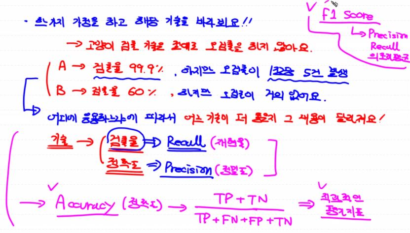

## 성능평가 지표

* 예측한 모델이 얼마나 정확한지에 대해서는 아래와 같은 지표들로 평가가 가능하다. 크게 3가지로 분류된다.





### 다음으로 몇 가지 용어에 대해 이해를 하자

* Learning rate는 적절한 경우 모델 예측에 도움이 되지만 크거나 작을 경우 아래와 같은 문제가 일어날 수 있다. (Overshooting / Local minima)

* Normalization은 여러가지가 있지만 우리는 주로 Min-Max Normalization을 사용했다.
* underfitting은 학습이 너무 빈약하여 잘 이루어져 있지 않을 경우를 뜻하며 overfitting은 training data에 대해 너무 학습이 되어 오히려 실제 데이터에 적용이 안되는 경우를 말한다.


* Overfitting을 해결하는 방법은 아래와 같은 방법이 있다.


* 전체 학습데이터를 training data와 testing data로 나누어서 성능을 평가한다. 모델에 개선작업이 필요하면 traning data의 일부를 validation data set으로 이용한다.


* 만약 데이터의 양이 작으면 cross validation을 이용하여 수행한다.


## Multinomial

Multinomial classification도 앞에서 수행한 Binary classification과 비슷하다. 다만 항의 개수에 맞게 logistic regression을 수행하는 점이 다르다.


* 위의 내용을 특정 예제를 통해서 코드로 구현해보자

```python
# BMI 지수로 학습해보자. => 키와 몸무게를 가지고 저체중, 정상 과체중 비만을 판단하는 지수
# BMI = 자신의 몸무게(kg) / 키의 제곱(m)
#      18.5 이하 => 저체중
#      18.5 ~ 23 => 정상
#      23 ~ 25 => 과체중
#      25 ~ => 비만
# 우리가 하려는 건 식이 아니라 BMI 지수를 조사한 데이터가 있다.
# 이걸 학습해서 예측을 통해 나의 BMI 지수를 알아보자
# 단 제공하는 데이터는 4가지가 아니라 3가지 분류로 되어있다.

import numpy as np
import pandas as pd
from scipy import stats
from sklearn.model_selection import train_test_split
from sklearn.preprocessing import MinMaxScaler
from sklearn.linear_model import LogisticRegression
from sklearn.model_selection import cross_val_score
from sklearn.metrics import accuracy_score

df = pd.read_csv('./data/bmi/bmi.csv', skiprows=3)

# display(df)

# 결측치 확인
# df.isnull().sum()        # 결측치 없음

# 이상치 확인
zscore = 1.8

# 이상치를 확인
# df.loc[np.abs(stats.zscore(df['height'])) >= zscore, :] # height의 이상치는 없다
# df.loc[np.abs(stats.zscore(df['weight'])) >= zscore, :] # weight의 이상치는 없다
# df.loc[np.abs(stats.zscore(df['label'])) >= zscore, :] # label의 이상치는 없다

# Data Split
# Train, Test 두 부분으로 분할. 분리하는 비율은 7:3으로 분리
# 나중에 Train부분은 k-fold cross validation을 진행
x_data_train, x_data_test, t_data_train, t_data_test = \
train_test_split(df[['height','weight']],df['label'],test_size = 0.3, random_state=0) # 14000 / 6000

# Normalization
scaler = MinMaxScaler()  # scaler 객체를 생성
scaler.fit(x_data_train) # scaler 객체에 최대 최소와 같은 정보가 들어간다. (fit 처리)

x_data_train_norm = scaler.transform(x_data_train)
x_data_test_norm = scaler.transform(x_data_test)

del x_data_train       # 혼동 방지를 위해 변수를 삭제
del x_data_test

# sklearn 구현은 매우매우 간단 - model 생성하고 학습진행
model = LogisticRegression()
model.fit(x_data_train_norm, t_data_train)

# 우리 model의 정확도를 측정해야한다.
# cross validation
kfold = 10
kfold_score = cross_val_score(model,x_data_train_norm, t_data_train, cv=kfold)
print('### cross validation ###')
print('score : {}'.format(kfold_score))
print('평균: {}'.format(kfold_score.mean()))

# 최종모델평가
predict_val = model.predict(x_data_test_norm)  # 테스트 데이터로 예측값을 구해요
acc = accuracy_score(predict_val, t_data_test)

print('우리 Model의 최종 Accuracy : {}'.format(acc))

# Predict

height = 188
weight = 78
my_state = [[height,weight]]
my_state_val = model.predict(scaler.transform(my_state))
print(my_state_val)
```

