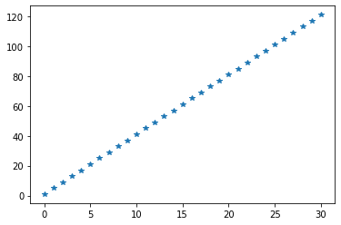

# numpy 기본 명령어

## 1. 기본 속성

### 1) Jupyter 노트북 기본

* 생성된 하나의 창을 cell이라고 부른다. 
* a key : 현재 cell 위쪽에 새로운 cell을 생성
* b key : 현재 cell 아래쪽에 새로운 cell을 생성
* dd key : 현재 cell을 삭제
* Ctrl + Enter : 현재 cell을 실행

### 2) Numpy 기본

* Numpy는 ndarray라고 불리는 n-차원의 배열을 제공한다.

  * 특징 1 : Python의 list와 유사하다.

  * 특징 2 : python의 llist는 다른 데이터 타입을 같이 list안에 저장이 가능하지만

    ​			  Numpy의 ndarray는 모두 같은 데이터 타입을 사용해야 한다.

  * 특징 3 : Python의 list보다 메모리 효율이나 실행속도면에서 우위

* numpy module을 설치하고 진행 필요 !

  * 기본 cmd창: pip install numpy
  * 아나콘다 cmd창: activate 'data_env(가상환경)' 후 conda install numpy


## 2. Numpy 속성

### 1) numpy의 view/type

``` python
import numpy as np

# python의 list와 비교해보자
a = [1, 2, 3, 4, 5] # python의 list
print(a)            # [1, 2, 3, 4, 5] ==> list의 literal
print(type(a))      # <class 'list'>

# Numpy의 ndarray를 만들어보자
arr = np.array([1,2,3,4,5])
print(arr)           # [1 2 3 4 5] ==> ndarray의 literal
print(type(arr))     # <class 'numpy.ndarray'>
print(arr.dtype)     # int32 (int:정수, 32:32bit)
print(arr[0])        # 1 
print(type(arr[0]))  # <class 'numpy.int32'>

arr = np.array([100, 3.14, True, 'Hello'])
print(arr)			 # ['100' '3.14' 'True' 'Hello']
```

## 2) numpy의 차원

``` python
# numpy는 차원이라는 속성을 가진다. 
# (ndarray의 d는 dimension을 의미), list는 중첩리스트만 존재한다.
# 다차원의 ndarray를 만들어 보자

a = [[1, 2, 3]
     [4, 5, 6]]

arr = np.array(a)
print(arr)				# [[1 2 3]
 						#  [4 5 6]]
print(arr[1,1])			# (행,열) => 5
```

* ndarray는 dtype 속성을 가진다. (int32, float64, etc...)

``` python
a = [[1, 2, 3],
     [4, 5, 6]]
arr = np.array(a, dtype=np.float64)
print(arr)				# => [[1. 2. 3.]
 						#	  [4. 5. 6.]]
```

* 차원 관련 속성에 대해 알아보자.

``` python
a = [1, 2, 3, 4]

arr = np.array(a, dtype=np.float64)
print(arr)			# [1. 2. 3. 4.]
print(arr.ndim)		# 차원의 개수 => 1
print(arr.shape)	# 차원의 개수와 각 차원의 요소를 tuple로 표현 => (4,)

a = [[1, 2, 3], 
     [4, 5, 6], 
     [7, 8, 9], 
     [10, 11, 12]]

arr = np.array(a, dtype=np.float64)
print(arr.shape)   # (4, 3)

## 3차원 중첩 리스트를 만들어보자
## ndarray를 생성한 후 shape을 출력하면 (2, 2, 3) 나오도록 작성한다면?
a = [[[1, 2, 3], 
      [1, 2, 3]],
     [[1, 2, 3], 
      [1, 2, 3]]]
arr = np.array(a)
print(arr)
print(arr.shape)		# (2, 2, 3)
```

* numpy array의 크기를 알아보자

``` python
a = [[1,2,3],[4,5,6],[7,8,9],[10,11,12]]

arr = np.array(a, dtype=np.float64)  # 4 X 3
print(arr)
print(arr.size) # 12
print(len(arr)) # 첫번째 차원의 요소 개수를 리턴 => 4

print(arr.shape) # (4,3)
arr.shape = (2,6)     # shape 변경 가능
print(arr)

arr.shape = (3,2,2)
print(arr)

arr.shape = (3,2,3)  # => valueError

# numpy array는 shape을 내가 원하는 식으로 변경할 수 있다.
# 하지만... shape 속성을 이용해서 변경하는 방식은 잘 사용하지 않는다.
# shape을 변경하기 위해서는... reshape() 함수를 이용한다.
```

* dtype도 지정, 변경이 가능하다.

``` python 
arr = np.array([1.5, 2.3, 8.3, 9.8, 7.7], dtype = np.float64)

result = arr.astype(np.int32)
print(result)			# [1 2 8 9 7]
print(result.dtype)		# int32
```

### 3) ndarray 생성 방법

* 위에서는 python의 list를 이용하여 ndarray를 만들었다. 그 외에도 여러가지가 존재한다.

``` python
import numpy as np

# 1. zeros
arr = np.zeros((3,4)) # 0으로 채운 ndarray를 만든다.
					  # 인수는 shape을 명시해야한다. dtype은 np.float64가 default
print(arr)
#[[0. 0. 0. 0.]
# [0. 0. 0. 0.]
# [0. 0. 0. 0.]]

# 2. ones
arr = np.ones((2,5)) # 1로 채운 numpy array를 만든다.

# 3. full
arr = np.full((3,5), 7, dtype=np.float64)	# 지정한 숫자로 채운 numpy array 생성
print(arr)
#[[7. 7. 7. 7. 7.]
# [7. 7. 7. 7. 7.]
# [7. 7. 7. 7. 7.]]

# 4. empty
arr = np.empty((3,3))	# 3 X 3 ndarray를 생성하는데... 초기값을 주지 않는다.
						# 내가 원하는 shape의 공간만 설정. 초기화 하지 않는다.
print(arr)
#[[8.992e-322 0.000e+000 0.000e+000]
# [0.000e+000 0.000e+000 3.854e-321]
# [0.000e+000 0.000e+000 0.000e+000]]

################################################################

arr = np.array([[(1, 2, 3), (4, 5, 6)]])
print(arr)
# [[[1 2 3]
#   [4 5 6]]]

# ones, zeros, full, empty 이런 함수들과 상당히 유사한 함수들
result = np.zeros_like(arr, dtype=np.float64) # arr과 shape이 같은 zeros array생성
print(result)
#[[[0. 0. 0.]
#  [0. 0. 0.]]]

result = np.ones_like(arr, dtype=np.float64)
print(result)
```

* arange

``` python
# python의 range와 상당히 유사
# 주어진 범위 내에서 지정한 간격으로 연속적인 원소를 가진 ndarray를 생성

arr = np.arange(1, 10, 1)
print(arr)		# [1 2 3 4 5 6 7 8 9]
```

* linspace

``` python
# linspace 기능을 확인하기 위해서 그래프로 데이터를 그려보자 !
# matplotlib module (더 확장된 seaborn도 있다)

import numpy as np
import matplotlib.pyplot as plt

# np.linspace(start, stop, num) : start는 시작 값, stop은 끝 값, num은 개수
# start부터 시작해서 stop까지 범위에서 num개의 숫자를 균일한 간격으로 데이터를 생성하는 ndarray를 만드는 함수다.

arr = np.linspace(1, 121, 31) 
# (stop-start)/(num-1) 간격 => 120/30=4 => [1 5 9 ....]
print(arr)	# [  1.   5.   9.  13.  17.  21.  25.  29.  33.  37.  41.  45.  49.  53. 57.  61.  65.  69.  73.  77.  81.  85.  89.  93.  97. 101. 105. 109. 113. 117. 121.]

plt.plot(arr, '*')
plt.show()
```



* 랜덤값을 기반으로 생성할 수도 있다.

``` python
# 총 5가지 방법으로 ndarray를 생성할 수 있다.

# 1. np.random.normal() : 정규분포 확률밀도함수에서 실수 표본을 추출해서 ndarray 생성
#                         평균, 표준편차

mean = 50
std = 2
arr = np.random.normal(mean,std, (100000,))
print(arr)
plt.hist(arr,bins=100)
plt.show()

# 2. np.random.rand(d0,d1,d2,...) : 실수를 추출하는데 [0,1) 범위에서 추출하고 균등분포로 추출
arr = np.random.rand(100000)
print(arr)
plt.hist(arr,bins=100)
plt.show()

# 3. np.random.randn(d0,d1,d2,...) : 실수추출, 표준정규분포에서 난수를 추출 (평균이0, 표준편차1)
arr = np.random.randn(100000)
print(arr)
plt.hist(arr, bins=100)
plt.show()

# 4. np.random.randint(low,high,shape) : 균등분포 확률밀도 함수에서 난수를 추출하는데
#                                        정수값을 추출
arr = np.random.randint(-100,100,(100000,))
print(arr)
plt.hist(arr, bins=100)
plt.show()

# 5. np.random.random(shape) : [0.1) 균등분포에서 실수 난수를 추출
arr = np.random.random((100000,))
print(arr)
plt.hist(arr, bins=100)
plt.show()
```

* 랜덤 관련 함수에 대해서 알아보자.

``` python
# 1. 난수의 재현
#    랜덤값도 실제로는 특정 알고리즘의 결과물...초기에 시작값을 설정해주면
#    항상 같은 랜덤값이 도출된다.

np.random.seed(10)
arr = np.random.randint(0,100,(10,))
print(arr)

# 2. ndarray의 순서를 랜덤하게 바꿀려면 어떻게 해야 하나요??
arr = np.arange(10)
print(arr)
np.random.shuffle(arr) # ndarray자체가 변형돼요
print(arr)

# 3. ndarray안에서 일부를 무작위로 선택하는 기능. sampling기능을 수행하려면
#    choice() 함수를 이용하면 돼요
#  np.random.choice(arr, size, replace, p)

# arr : numpy array가 나오거나 혹은 정수가 나올 수 있어요 만약 정수면
#       arange(정수)
# size : 정수값, 샘플의 숫자
# replace: Boolean(True,False)
#          True : 한번 선택한 데이터를 다시 샘플링 할 수 있다
# p : ndarray. 각 데이터가 샘플링될 확률을 가지고 있는 ndarray

arr = np.random.choice(5, 3, replace=True)
print(arr)

arr = np.random.choice(5, 10, replace=True, p=[0.2,0,0.3,0.4,0.1])
print(arr)
```

### 4) Shape 조절

``` python
# shape 속성의 값을 바꾸어서 ndarray의 형태를 변경하는것은 좋지 않다
# reshape() 함수를 이용해서 처리한다.
import numpy as np

arr = np.arange(0,12,1)

arr1 = arr.reshape(4,3)

arr[0] = 100
print(arr)
print(arr1)

arr = np.arange(0,12,1)
arr1 = arr.reshape(2,6).copy()   # view가 아니라 진짜 shape을 바꾼 ndarray를 만들려면

# reshape()을 이용해서 shape을 조절할 수 있어요!!

# ravel() : ndarray의 모든 요소가 포함된 1차원 vector를 리턴 !!
#           View를 리턴함 -> .copy() 해줘야 만들 수 있음

arr = np.arange(0,100,1).reshape(5,-1).copy()
print(arr)
#[[ 0  1  2  3  4  5  6  7  8  9 10 11 12 13 14 15 16 17 18 19]
# [20 21 22 23 24 25 26 27 28 29 30 31 32 33 34 35 36 37 38 39]
# [40 41 42 43 44 45 46 47 48 49 50 51 52 53 54 55 56 57 58 59]
# [60 61 62 63 64 65 66 67 68 69 70 71 72 73 74 75 76 77 78 79]
# [80 81 82 83 84 85 86 87 88 89 90 91 92 93 94 95 96 97 98 99]]

arr1 = arr.ravel()
print(arr1)
# [ 0  1  2  3  4  5  6  7  8  9 10 11 12 13 14 15 16 17 18 19 20 21 22 23
#  24 25 26 27 28 29 30 31 32 33 34 35 36 37 38 39 40 41 42 43 44 45 46 47
#  48 49 50 51 52 53 54 55 56 57 58 59 60 61 62 63 64 65 66 67 68 69 70 71
#  72 73 74 75 76 77 78 79 80 81 82 83 84 85 86 87 88 89 90 91 92 93 94 95
#  96 97 98 99]
```


