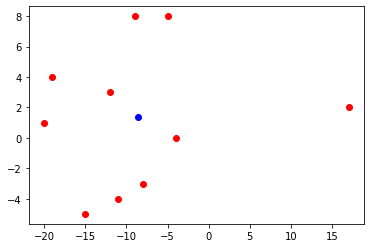

# Pandas


## Pandas 기본

* Pandas는 ndarray(Numpy)를 기본 자료구조로 이용한다.

* Pandas는 두개의 또 다른 자료구조를 이용한다.

  * Series: 동일한 데이터 타입의 복수개의 성분으로 구성되는 자료구조. (1차원)
  * DataFrame : 엑셀에서 Table과 같은 개념, Database의 Table과 같은 개념

  ​       여러개의 Series로 구성되어 있다. (2차원)

* pandas를 설치한 후 진행하면 된다. 가상환경 => conda install pandas

```python
# ndarray
arr = np.array([-1, 4, 5, 99], dtype=np.float64)
print(arr)        # [-1.  4.  5. 99.]

# pandas의 Series
s = pd.Series([-1, 4, 5, 99], dtype=np.float64)
print(s)            # 0    -1.0
                    # 1     4.0
                    # 2     5.0
                    # 3    99.0
                    # dtype: float64
print(s.values)     # [-1.  4.  5. 99.]
print(s.index)      # RangeIndex(start=0, stop=4, step=1)
print(s.dtype)      # float64
```


## Series

* Series 생성 시 index를 지정하지 않으면 숫자 index로 지정된다.
* 혹은 list로 index를 지정할 수 있다.

```python
s = pd.Series([1, -8, 5 ,10],
             dtype=np.float64,
             index=['c','b','a','k'])
print(s)
print(s[0])   # 1.0
print(s['c']) # 1.0   

# 그러면 만약 index를 우리가 새로 지정해서 사용할 때
# 같은 index가 있으면 어떻게 될까? => 문제 없이 실행 된다

s = pd.Series([1, -8, 5 ,10],
            dtype=np.float64,
            index=['c','b','c','k'])
print(s)
print(s['c'])   # 어떤걸 가져오나 ? => 다 가져오고 결과가 Series로 리턴

# Series에서 slicing
print(s[1:3])      # Series로 결과 return  => 뒤에 있는거 exclude
print(s['b':'k'])  # 숫자인덱스로 slicing한 결과와 다르다 => 뒤에 있는거 include임

# Boolean indexing
print(s[s % 2 == 0])   # 짝수만 출력

# Fancy Indexing
print(s[[0,2,3]])

# Numpy에서 했던 여러가지 작업들이 그대로 사용 가능
print(s.sum())
```

* 아래 연습문제를 해결하면서 Series의 특성을 더 알아보자

```python
# A공장의 2020-01-01부터 10일간 생산량을 Series로 저장하자
# 생산량은 평균이 50이고 표준편차가 5인 정규분포에서 랜덤 생성 (정수로 처리)

# B공장의 2020-01-01부터 10일간 생산량을 Series로 저장하자
# 생산량은 평균이 70이고 표준편차가 8인 정규분포에서 랜덤 생성 (정수로 처리)

# 예) 2020-01-01 53

# Series를 한번 만들어보자
import numpy as np
import pandas as pd
from datetime import date, datetime, timedelta

start_day = date(2020,1,1)

A = pd.Series([int(x) for x in np.random.normal(50,5,(10,))],
             index=[start_day + timedelta(days=x) for x in range(10)])
print(A)

B = pd.Series([int(x) for x in np.random.normal(70,8,(10,))],
             index=[start_day + timedelta(days=x) for x in range(10)])
print(B)

## 날짜별로 모든 공장의 생산량 합계를 구해보자
print(A+B)    # 사실은 index를 기준으로 같은 index끼리 더하는 거다.

b_start_day = datetime(2020,1,5)

B = pd.Series([int(x) for x in np.random.normal(70,8,(10,))],
             index=[b_start_day + timedelta(days=x) for x in range(10)])
print(B)

print(A+B)
```

* 만약 index가 다를경우 더하면 어떻게 될까

```python
start_day = date(2020,1,1)

A = pd.Series([int(x) for x in np.random.normal(50,5,(10,))],
             index=[start_day + timedelta(days=x) for x in range(10)])
print(A)

b_start_day = datetime(2020,1,5)

B = pd.Series([int(x) for x in np.random.normal(70,8,(10,))],
             index=[b_start_day + timedelta(days=x) for x in range(10)])
print(B)

print(A+B)

#2020-01-01      NaN
#2020-01-02      NaN
#2020-01-03      NaN
#2020-01-04      NaN
#2020-01-05    116.0
#2020-01-06    128.0
#2020-01-07    120.0
#2020-01-08    100.0
#2020-01-09    121.0
#2020-01-10    115.0
#2020-01-11      NaN
#2020-01-12      NaN
#2020-01-13      NaN
#2020-01-14      NaN
#dtype: float64
```

* 새로운 data를 Series에 추가해보자

```python
s = pd.Series([1,2,3,4])

s[4] = 100    # 4  100  추가
print(s)

s[6] = 200    # 5가 아니면 6 200 추가
print(s)

# Series에서 특정 index를 삭제하려면
s = s.drop(2)
```

* Dictionary를 이용해서도 Series를 만들 수 있다

```python
import numpy as np
import pandas as pd

my_dict = { '서울':1000, '부산':2000, '제주':3000 }

s = pd.Series(my_dict)

s.name = '지역별 가격 데이터!!'      # Name 부여 가능
s.index.name = '지역명'              # Index Name 부여 가능

print(s)

#지역명
#서울    1000
#부산    2000
#제주    3000
#Name: 지역별 가격 데이터!!, dtype: int64
```


## DataFrame

* Dictionary로 만들어보자

```python
 dictionary로 dataFrame을 생성할 때 데이터의 개수가 맞지 않으면 Error가 발생한다.
# dictionary의 key가 DataFrame의 column
# DataFrame은 Series의 집합으로 구성 (각각의 colum이 Series)

import numpy as np
import pandas as pd

# dictionary
data = { 'names': ['아이유', '김연아', '홍길동', '강감찬', '이순신'],
         'year' : [2015, 2019, 2020, 2013, 2017],
         'points' : [3.5, 1.5, 2.0, 3.4, 4.0]
       }

# DataFrame을 생성
df = pd.DataFrame(data)

# DataFrame을 출력할 때는 display()를 이용해서 출력한다.

display(df)

# 기억해야하는 속성들을 알아보자 (ndarry와 동일)
print(df.shape)  # tuple로 표현된다. (5, 3)
print(df.size)   # 15
print(df.ndim)   # 2
```

* DataFrame의 index, values, colums

```python
import numpy as np
import pandas as pd

# dictionary
data = { 'names': ['아이유', '김연아', '홍길동', '강감찬', '이순신'],
         'year' : [2015, 2019, 2020, 2013, 2017],
         'points' : [3.5, 1.5, 2.0, 3.4, 4.0]
       }

# DataFrame을 생성
df = pd.DataFrame(data)
display(df)

print(df.index)     # RangeIndex(start=0, stop=5, step=1)
print(df.columns)   # Index(['names', 'year', 'points'], dtype='object')
print(df.values)    # 2차원 ndarry

df.index.name = '학번'
df.columns.name = '학생정보'
display(df)
```


## DataFrame 생성 - 다양한 방법

### 1. CSV 파일을 이용해서 DataFrame을 생성

```python
# CSV 파일을 하나 만들어서 DataFrame을 생성해 보자
# student.csv
# c:/notebook_dir/data/studen.csv 생성한다. (txt파일로 만들면 된다.)

df = pd.read_csv('./data/student.csv')

display(df)

# 처음부터 5개만 출력하려면 ??
# display(df.head())
# 끝부터 5개만 출력은 ?
# display(df.tail())

# pandas는 문자열 처리시 numpy보다 훨씬 효율적인 방법을 제공!!
```


### 2-1. Database를 이용해서 dataframe을 생성

```python
# 여러가지 DBMS 제품들이 있다.
# 데이터베이스는 일반적으로 정제된, 연관성이 있는 자료의 집합.
# CS분야에서는 데이터베이스가 파일에 저장되어 있고, 다루기 위해서는 프로그램이 필요하다.
# 이런 프로그램들을 DBMS(DataBase Management System)라고 한다.
# Oracle, Cybase, DB2, Infomix, MySQL, SQLite, etc...
# MySQL을 가지고 데이터베이스를 구축한 후 이 데이터를 pandas의 DataFrame으로 가져올 것이다.

# MySQL이라는 DBMS로 데이터베이스를 생성해 데이터베이스를 구축한다.
# 그 안에 있는 데이터를 추출해서 DataFrame으로 생성해보자.

# 사용할 MySQL버전은 5.6버전을 사용함
# 추후에 프로젝트에서 Database에 쌓여 있는 데이터를 가져다가 분석, 학습작업을 진행
# 해야 하는데 이때 데이터 정제하고 전처리하는데 pandas가 이용된다.

# 아래는 MySQL 실행법이다.
# 1. MySQL 5.6 버전을 다운로드한 후 적절한 경로에 압축을 푼다.
# 2. mysqld를 실행해서 MySQL DBMS Server를 시작한다. => bin 폴더 경로에서
# 3. MySQL Server를 실행시켰기 때문에 MySQL console과 MySQL 시스템에 접속 가능하다.
# 4. MySQL Server를 정상적으로 중지하려면 새로운 command창을 띄워서
#  bin 폴더로 이동 => mysqladmin -u root shutdown
# 5. MySQL Server를 다시 기동시킨 후
# 6. MySQL 시스템에 접속 => cmd창을 열어서 => mysql -u root
#    (root 유저 권한으로 mysql 시스템에 접속한다는 의미)
# 7. 새로운 사용자를 생성 => create user data identified by "data";
# 8. 새로운 사용자 하나 더 =>create user data@localhost identified by "data";
# 9. 데이터베이스를 생성해야 한다.
#     => create database library;
# 10. 생성한 데이터베이스(library)에 대한 사용권한을 새롭게 생성한 data사용자에 부여
#    => grant all privileges on library.* to data;
#    => grant all privileges on library.* to data@localhost;
# 11. 지금까지 작업한 권한부여작업을 flush
#    => flush privileges;
# 12. 작업이 완료되었으니 console을 종료 => exit;
# 13. 제공된 파일을 이용해서 실제 사용할 데이터베이스를 구축해보자
# 14. sql 파일을 bin폴더에 복사한 다음 다음의 명령어를 도스창에서 실행!!
#     => mysql -u data -p library < _BookTableDump.sql

# 데이터베이스 구축이 끝났으니 pandas로 데이터베이스에 접속해서 데이터를 가져다가
# DataFrame을 만들자
# python으로 mysql database를 사용하는 기능을 사용한다.
# 이 기능을 하기 위한 package(module)이 필요

import pymysql.cursors
import pandas as pd

# pymysql이라는 module을 이용해서 데이터베이스에 연결

conn = pymysql.connect(host='localhost',
                       user='data',
                       password='data',
                       db='library',
                       charset='utf8')

# 데이터베이스에 접속되면 SQL문을 실행시켜서 Database로부터
# 데이터를 가져온 후 이놈을 DataFrame으로 생성
sql = 'select btitle, bauthor, bprice from book'

df = pd.read_sql(sql, con=conn)

display(df)
```

* Database Table을 사용하는 방법은 크게 2가지가 있다.
  * Django에서 사용한 ORM 방식 (Model을 이용해서 Table 사용)
  * 일반적인 SQL 구문을 이용해서 Table을 사용 -> 원하는 데이터 추출 가능

```python
import pymysql.cursors
import pandas as pd

# pymysql이라는 module을 이용해서 데이터베이스에 연결

conn = pymysql.connect(host='localhost',
                       user='data',
                       password='data',
                       db='library',
                       charset='utf8')

# 데이터베이스에 접속되면 SQL문을 실행시켜서 Database로부터
# 데이터를 가져온 후 이놈을 DataFrame으로 생성!

# 책 가격이 30000원 넘는 책들만 골라오려면
sql = 'select btitle, bprice from book WHERE bprice > 30000'

# 책 제목에 특정 키워드가 들어가 있는 책들만 골라오려면
sql = 'select btitle, bprice from book WHERE btitle like "%여행%"'

df = pd.read_sql(sql, con=conn)

display(df)
```


### 2-2. JSON 파일을 이용해 DataFrame 생성

* Json 파일로 저장할 때 4가지 방식이 있다.

```python
# Database안의 book table에서 원하는 내용의 데이터를 가져온 후 DataFrame으로
# 만들어서 이 DataFrame을 JSON으로 만들거다.

import pymysql.cursors
import pandas as pd

conn = pymysql.connect(host='localhost',
                       user='data',
                       password='data',
                       db='library',
                       charset='utf8')

sql = 'select btitle, bauthor, bprice from book WHERE btitle like "%여행%"'

df = pd.read_sql(sql, con=conn)

display(df)

# DataFrame을 json파일로 저장할 때 4가지 서로 다른 형식이 존재.
# unicode로 파일을 생성한 후 데이터를 저장해야 한글이 정상 처리가 된다.

# with : 일반적으로 파일처리할 때 순서는 파일열기 - 내용쓰기 - 파일닫기 이 순서다
# with 구문을 이용하면 resource의 close처리(해제처리)가 자동으로 이루어진다.

with open('./data/json/books_columns.json', 'w', encoding='utf-8') as file:
    df.to_json(file, force_ascii=False, orient='columns')
    # orient = columns로 설정하면 df의 column이 json의 key값으로 들어간다.
    
with open('./data/json/books_records.json', 'w', encoding='utf-8') as file:
    df.to_json(file, force_ascii=False, orient='records')

with open('./data/json/books_index.json', 'w', encoding='utf-8') as file:
    df.to_json(file, force_ascii=False, orient='index')

with open('./data/json/books_values.json', 'w', encoding='utf-8') as file:
    df.to_json(file, force_ascii=False, orient='values')
```

* 이제 만들어진 JSON 파일을 읽어서 DataFrame을 생성해보자

```python
# JSON 파일을 읽어서 DataFrame을 생성해 보아요 !!

import numpy as np
import pandas as pd
import json

# 우리가 가지고 있는 json 파일을 open해서 json 내용을 읽는다.
with open('./data/json/books_columns.json', 'r', encoding='utf-8') as file:
    dict_books = json.load(file)    # json 데이터를 python의 dictionary로 저장
    
print(dict_books)
print(type(dict_books))   # <class 'dict'>

df = pd.DataFrame(dict_books)

display(df)
```


### 3. Open API를 이용해서 DataFrame을 생성

* 영화진흥위원회 open api를 이용해서 json을 받아온 후 DataFrame을 만들어보자

```python
import numpy as np
import pandas as pd
import json
import urllib

# 우리가 호출할 open api url이 있어야 한다.
key = 'ea553ad823b28ca691993201adebed1e'
targetDt = '20200901'

openapi_url = 'http://www.kobis.or.kr/kobisopenapi/webservice/rest/boxoffice/searchDailyBoxOfficeList.json?key={}&targetDt={}'.format(key, targetDt)  
# open api 호출하는 url

load_page = urllib.request.urlopen(openapi_url) # request를 보냈으니 response가 온다.
# load_page => response 객체

json_page = json.loads(load_page.read())   # dictionaray를 추출

print(json_page)   # dictionary.. 이놈을 분석해서 dataframe을 생성해야 한다.

# 얻어온 정보 중 순위, 영화제목, 총매출액 정도만 dataframe으로 만들어보자
# DataFrame의 values에는 영화제목과 총 매출액을 저장하고
# DataFrame의 index에는 순위값을 지정해서 DataFrame을 생성합니다.
movie_data = dict()
rank_list = list()
title_list = list()
sales_list = list()

for tmp in json_page['boxOfficeResult']['dailyBoxOfficeList']:
    rank_list.append(tmp['rank'])
    title_list.append(tmp['movieNm'])
    sales_list.append(tmp['salesAcc'])
    
movie_data['영화제목']= title_list
movie_data['총매출액']= sales_list

df = pd.DataFrame(movie_data)
df.index = rank_list
display(df)
```

* Dictionary 자체로 생성 가능하며 DataFrame은 기본 분석함수를 제공한다.

```python
import numpy as np
import pandas as pd

# dictiionary 하나 만들어요
data = { '이름':['이지은', '박동훈', '홍길동', '강감찬', '오혜영'],
       '학과':['컴퓨터', '기계', '철학', '컴퓨터', '국어국문'],
       '학년':[1, 2, 2, 4, 3],
       '학점':[1.5, 2.0, 3.1, 1.1, 2.7]}

df = pd.DataFrame(data, 
                 columns=['학과','이름','학점','학년', '등급'],
                 index=['one', 'two', 'three', 'four', 'five'])
display(df)

# DataFrame은 기본 분석함수를 제공해준다.
# 기본 분석함수 => count, 평균, 표준편차, 최대, 최소, 사분위

# DataFrame안에 있는 숫자 연산이 가능한 column에 한해서 기본 분석함수를 적용하여 리턴
display(df.describe())

```


## DataFrame의 특성

### 1. Column Indexing

```python
# 먼저 column을 추출하는 방법에 대해서 알아보자

## DataFrame에서 특정 column을 추출할 수 있다.
## 만약 하나의 column을 DataFrame에서 추출하면 그 결과는 Series가 된다.

import numpy as np
import pandas as pd

data = { '이름':['이지은', '박동훈', '홍길동', '강감찬', '오혜영'],
       '학과':['컴퓨터', '기계', '철학', '컴퓨터', '철학'],
       '학년':[1, 2, 2, 4, 3],
       '학점':[1.5, 2.0, 3.1, 1.1, 2.7]}

df = pd.DataFrame(data, 
                 columns=['학과','이름','학점','학년', '등급'],
                 index=['one', 'two', 'three', 'four', 'five'])
# display(df)

# ## 특정 column data를 추출
# print(df['이름'])   # 결과를 Series로 return
# print(df.이름)      # 동일하긴 하지만 많이 사용되지 않음 -> 프로그래밍에 부적합 형태

```

* 추출한 후 데이터를 변경해 보자

```python
year = df['학년']    # year는 학년 column series => View !!
year['one'] = 100    # one index 값을 100으로 변경된다. year에 .copy()를 하면 안 변경
print(year)
display(df)
```

* 두 개 이상의 column을 추출하려면 ? => Fancy indexing을 사용

```python
distplay(df['학과':'학점'])  # Error (slicing은 적용할 수 없다)
display(df[['학과','학점']]) # Fancy indexing
```

* 특정 column의 값을 수정하려면 ? => 단일값, numpy array, list를 이용해서 수정

```python
df['등급'] = 'A'  # 모두 다 A로 채워짐
df['등급'] = ['A', 'B', 'A', 'D', 'F']    # 개수가 안 맞으면 에러가 난다.
df['등급'] = np.array(['A', 'B', 'A', 'D', 'F']) # 개수가 안 맞으면 에러가 난다.
display(df)
```

* 두 개 이상 특정 값을 수정하는 것도 동일한 방법이다.

```python
df[['학과','등급']] = 'A'  # 모두 다 A로 채워짐
df[['학과', '등급']] = [['영어영문', 'A'],
                        ['철학', 'C'],
                        ['국어국문', 'B'],
                        ['화학', 'F'],
                        ['물리', 'C']]

display(df)
```

* column을 추가하려면 어떻게 해야할까?

```python
# 현재 DataFrame에 '나이' column을 추가하고 싶다.
df['나이'] = [20,21,22,23,24]  # column 추가 가능 -> 단 개수가 맞아야함
display(df)

df['나이'] = pd.Series([20,21,22,23,24])  # 추가가 안된다. => 
                                      # Series로 추가할 때는 값의 대입 기준이 index
# Series로 새로운 column을 추가할 때는 index를 매칭시켜야지 값이 정상적으로 들어간다.

df['나이'] = pd.Series([20,21,22,23,24],
                    index=['one','two','three','four','five'])

# 다양한 수의 데이터를 골라서 추가할 수 있다. index기반으로 데이터 추가하기 때문에
df['나이'] = pd.Series([20,21,22],
                    index=['one','three','five'])

display(df)
```

* 조건을 통해서 Boolean column을 추가 가능하며 삭제도 가능하다.

```python
# 마지막에 column을 하나 추가한다. '장학생여부'
# 만약 학점이 3.0이상이면 True, 그렇지 않으면 False로 세팅
df['장학생여부'] = df['학점'] > 3.0
display(df)


# DataFrame에서 함수를 이용해서 column을 삭제할 수 있다. => 함수 이용에 주의해야한다.

# 열(column)을 삭제할 경우, 행(row)을 삭제할 경우 둘 다 drop()을 사용
# inplace = True이면 원본을 지운다.
# inplace = False면 원본은 보존하고, 삭제된 결과 df를 return
new_df = df.drop('학년', axis=1, inplace=False)

display(new_df)
```


### 2. Row indexing

```python
import numpy as np
import pandas as pd

data = { '이름':['이지은', '박동훈', '홍길동', '강감찬', '오혜영'],
       '학과':['컴퓨터', '기계', '철학', '컴퓨터', '철학'],
       '학년':[1, 2, 2, 4, 3],
       '학점':[1.5, 2.0, 3.1, 1.1, 2.7]}

df = pd.DataFrame(data, 
                 columns=['학과','이름','학점','학년', '등급'],
                 index=['one', 'two', 'three', 'four', 'five'])

# column indexing part 1 ( 행에 대한 숫자 index를 이용하는 방법)
# 단일 column을 indexing
print(df['이름'])   # Series로 리턴
display(df['학과':'학점'])  # Error. slicing 지원 x   Fancy indexing은 가능

# row indexing
print(df[0])   # Error. row에 대해서 숫자 index로 단일 indexing이 안된다
display(df[1:3]) # OK. slicing은 가능 - slicing 한 결과는 view, dataframe으로 return
display(df[1:])  # OK
display(df[[0,2]]) # Error. row에 대해서 index 숫자를 이용한 fancy indexing이 안됨

# row indexing - part 2 (행에 대한 별도의 index를 이용하는 방법)
df['one'] # Error
display(df['one' : 'three'])   # OK - index를 이용한 row slicing이 가능
display(df['three':])  # OK
display(df['three':-1]) # Error! 숫자 index와 index를 혼용해서 슬라이싱 할 수 없다.
display(df[['two','four']])  # Error. fany indexing 안됨

# row indexing - part 3 (loc[]를 row indexing. 많이 사용하는 방법 중 하나)
#                        loc를 이용할 때는 숫자 index가 아닌 부여한 index를 이용
print(df.loc['one'])   # OK. loc와 index를 이용하면 단일 row를 추출가능. Series로
                        # loc는 숫자 index를 사용할 수 없다!
    
print(df.loc[0])   # error   => iloc[]를 사용해야한다.
display(df.loc['one':'three'])  # OK. slicing도 가능
display(df.loc['three':])  # OK. slicing도 가능
display(df.loc['three':-1])  # error! index를 혼합해서 사용하는 건 안됨
display(df.loc[['one','three']])   # OK. Fancy Indexing도 가능


# row indexing - part 4 (iloc[]를 row indexing에 사용. 많이 사용)
#                        loc[]와 다른점은 iloc[]는 무조건 숫자 index만 사용 가능

```

* loc[]를 이용하여 DataFrame의 행을 추출할 수 있다.

```python
import numpy as np
import pandas as pd

data = { '이름':['이지은', '박동훈', '홍길동', '강감찬', '오혜영'],
       '학과':['컴퓨터', '기계', '철학', '컴퓨터', '철학'],
       '학년':[1, 2, 2, 4, 3],
       '학점':[1.5, 2.0, 3.1, 1.1, 2.7]}

df = pd.DataFrame(data,
                 columns=['학과','이름','학점','학년', '등급'],
                 index=['one', 'two', 'three', 'four', 'five'])
display(df.loc['one','three'])  # 행 추출
display(df.loc['one','three'], '이름')    # Series
display(df.loc['one','three', '이름':'학년'])
display(df.loc['one','three',['이름','학년']])

# Boolean -> 학점이 1.5를 초과하는 학생의 이름과 학점을 출력해보자
df.loc[df['학점'] > 1.5, ['이름','학점']]

# 이름이 박동훈인 사람을 찾아 이름과 학점을 출력해보자
df.loc[df['이름']== '박동훈', ['이름','학점']]

# 학점이 1.5를 초과하고 2.5미만인 모든 사람을 찾아 학과,이름,학점을 출력해보자
df.loc[(df['학점'] > 1.5) & (df['학점'] < 2.5), '학과':'학점']

# 학점이 3.0을 초과하는 사람을 찾아 등급을 'A'로 설정한 후 출력해보자
df.loc[df['학점'] > 3.0, '등급'] = 'A'
display(df)
```

* iloc[] 이용한 indexing

```python
print(df.iloc[0,0])  # 컴퓨터
print(df.iloc[1])       # Series
display(df.iloc[1:4])   
df.iloc[[0,2],[1,3]]    # OK=> numpy에서는 행과열 동시에 fancy indexing 안됨 ->                             np.ix_()썼었음
                        # iloc[]는 가능하다
```

* 새로운 행을 추가하거나 삭제해보자

```python
df.loc['six', :] = ['영어영문', '최길동', 4.0, 3, 'A']
df.loc['six', ['학과','이름']] = ['영어영문', '최길동']  # 선택적으로도 가능하다.

display(df)

# DataFrame에서 특정 행을 삭제해보자
display(df.drop('학점', axis=1, inplace=False)) # column 지우는법
display(df.drop(['three','five'], axis=0, inplace=False)) # row 지우는법
```


##  DataFrame 통계적인 함수들

* 통계관련 함수들을 알아보자

``` python
# 기댓값(expected value) : 확률을 가진 사건을 무한히 반복했을 경우 기대할 수 있는 평균값

# 주사위 1개를 무한히 던졌을 때 기댓값은?
import numpy as np

result = np.random.randint(1,7, (1000000, ))
print(result.mean())

# 편차 (deviation) : 확률변수 x와 평균(기댓값)의 차이
# 국민개개인의 소득은 다르다. 예를 들어, 홍길동, 김길동, 아이유, 김연아, 놀부, ...
# 국민 평균 소득을 산출하여 편차를 구한다면
# 홍길동소득 - 평균소득, 김길동 - 평균, 아이유 - 평균, 김연아 - 평균, 놀부 - 평균, ...
# 편차를 이용하면 데이터의 흩어진 정도를 알기 쉽다.

# 편차의 가장 큰 단점 : 데이터의 흩어진 정도를 하나의 숫자로 표현하기는 힘들다 =>편차의 합은 0

# 분산(Variance) : 편차 제곱의 평균
# std(standard deviation) : 표준편차 => 분산의 제곱근

arr= np.array([4, 6, 1, 3, 8, 8], dtype=np.int32)
print(arr)
print(arr.sum())  # 30
print(arr.mean())  # 5.0
print(arr.var())   # 6.666666666666667
print(arr.std())   # 2.581988897471611

###########################

# 공분산 (covariance)
# 두 개의 확률변수의 관계를 보여줄 때 사용하는 값.
# 공분산은 두 확률변수의 편차의 곱에 대한 평균
# 확률변수 X(독립변수)와 Y(종속변수)에 대해 X가 변할때 Y가 변하는 정도

# 그래프를 이용해서 공분산의 의미를 파악해보자
import numpy as np
import matplotlib.pyplot as plt

# 독립변수 X에 대해 종속변수 Y의 값을 랜덤으로 생성해서 알아보자
np.random.seed(1)

x = np.random.randint(-20, 20, (10, ))
y = np.random.randint(-10, 10, (10, ))

x_mean = x.mean()   # X의 평균
y_mean = y.mean()   # Y의 평균

# 이렇게 구한 값을 가지고 scatter(산점도)를 그려보자
plt.scatter(x,y,color='red')
plt.scatter(x_mean,y_mean, color='blue')
plt.show()

# 공분산은 데이터의 변화량에 대한 총합을 의미
# 공분산이 양수인지, 음수인지에 따라서 데이터의 방향성을 알 수 있다.
# 공분산의 단점 => 단위의 문제때문에 연관성은 알 수 있는데 그 강도는 알 수 없다.

# 만약 확률변수 X와 Y가 독립이면 공분산이 0에 수렴
# 역은 성립하지 않음. 공분산이 0이면 두 확률변수는 독립이다 라고는 못함
```



* 공분산을 간단한 계산해보자

```python
np.random.seed(2)
sampleNum = 100    # 데이터의 개수

x = np.random.randint(0, 10, (sampleNum, ))
y = np.random.randint(-20, 20, (sampleNum, ))

x_mean = x.mean()   # X의 평균
y_mean = y.mean()   # Y의 평균

# 공분산은 편차의 곱의 평균!!
x_deviation = x - x_mean
y_deviation = y - y_mean

result = 0
for tmp in range(sampleNum):
    result += (x_deviation[tmp] * y_deviation[tmp])
    
result_covariance = result / (sampleNum-1)    # 표준 공분산
print(result_covariance)  # -0.591515151515151

print(np.cov(x,y))    # [[  7.52767677  -0.59151515]
                      #  [ -0.59151515 123.99636364]]
```

* 공분산에 대한 간단한 예제를 풀어보자

```python
# 주가를 이용해서 공분산 양수, 음수의 의미가 배운 내용과 일치하는지 확인해보자
# KOSPI 200안의 삼성전자 비중이 34%
# 삼성전자가 오르면 kospi가 오르고 떨어지면 kospi가 떨어질까 ?

import numpy as np
import pandas as pd
import pandas_datareader.data as pdr    # 주가데이터를 받기위해서 필요
from datetime import datetime

# 특정 날짜간격동안 주식데이터를 받아올거다.
# 특정 날짜 간격을 정해야 하는데 datetime을 이용해서 시작날짜와 끝날짜를 지정.
start = datetime(2018, 1,1)  # 2019년 1월 1일
end = datetime(2018,12,31)

# YAHOO에서 제공하는 주가지수를 얻어온다
df_KOSPI = pdr.DataReader('^KS11', 'yahoo', start, end)
df_SE = pdr.DataReader('005930.KS', 'yahoo', start, end)

# 반대로 움직이는 주식데이터를 가져와서 공분산이 음수가 되는지 확인!
# 남북경협주, 방산주
df_LIG = pdr.DataReader('079550.KS', 'yahoo', start, end)   # LIG넥스원(방산)
df_PUSAN = pdr.DataReader('011390.KS', 'yahoo', start, end)  # 부산산업(납북경협주)

closed_KOSPI = df_KOSPI['Close']  # 종가를 얻어온다 => 출력결과는 Series 
closed_SE = df_SE['Close']  # Series

closed_LIG = df_LIG['Close']  # Series
closed_PUSAN = df_PUSAN['Close']  # Series

print(np.cov(closed_KOSPI.values, closed_SE.values))   # 양수!!!
print(np.cov(closed_KOSPI.values, closed_SE.values))  # 음수
# 값이 양수다 => 하나가 증가하면 다른 하나가 증가하는 관계에 있다.
# 공분산으로는 두 데이터의 관계가 얼마나 강한지는 알 수 없다.
```

* 공분산의 경우 관계의 강도를 알 수 없기 때문에 상관계수 (피어슨 상관계수 등)를 더 많이 이용한다.

``` python
# 상관 계수는 공분산을 이용해서 도출하며 방향성과 두 데이터의 관련성 (얼마나 밀접한 관계가 있는지.. 연관성의 강도를 알 수 있다.)

# 상관계수 (correlation coefficient)
# 상관계수는 -1 ~ 1 사이의 실수 값.
# 0 : 서로 독립.   1쪽으로 갈수록 양의 상관관계, -1로 갈수록 ㄷ음의 상관관계

# 상관관계(correlation) : 두 대상이 서로 연관성이 있다고 추측되는 관계
# 성적과 자존감, 온라인 게임과 폭력성 ...

# 상관관계를 이야기할 때 조심해야할 점은 상관관계는 인과관계를 설명할 수 없다.
# 인과관계는 regression을 이용해서 인과관계를 분석!

# 우리가 실제로 많이 사용하는 지표는 => 상관계수 (-1 ~ 1)

start = datetime(2018, 1,1)  # 2018년 1월 1일
end = datetime(2018,12,31)

# YAHOO에서 제공하는 주가지수를 얻어온다
df_KOSPI = pdr.DataReader('^KS11', 'yahoo', start, end)
df_SE = pdr.DataReader('005930.KS', 'yahoo', start, end)

closed_KOSPI = df_KOSPI['Close']  # Series
closed_SE = df_SE['Close']  # Series

print(np.corrcoef(closed_KOSPI, closed_SE))
#[[1.         0.91357384]
# [0.91357384 1.        ]]
# 0.91이면 강한 양의 상관관계를 가진다는 것을 알 수 있다.
```


## DataFrame의 정렬 

* DataFrame의 정렬은 ndarray matrix의 sort와는 다르다.

```python
import numpy as np
import pandas as pd

# 난수의 재현성을 확보
np.random.seed(1)

# 2차원 ndarray를 정수형 난수로 생성하고 그 ndarry를 이용해서 DataFrame을 생성

df=pd.DataFrame(np.random.randint(0,10,(6,4)))
# display(df)

df.columns = ['A', 'B', 'C', 'D']
# display(df)

# 숫자 index 대신 날짜를 사용하자
df.index = pd.date_range('20200101', periods=6)
# display(df)

# 정렬 연습 => index부분을 shuffle하자
np.random.shuffle(df.index)  # error난다. index does not support mutable                                        operations

random_date = np.random.permutation(df.index)
df2 = df.reindex(index=random_date, columns=['B','A','D','C'])
np.random.shuffle(df.index.values)
display(df)
display(df2)

# DataFrame에서 정렬은 두가지만 알아두면 된다.
display(df2.sort_index(axis=0, ascending=True))  # 오름차순

# 또 다른 정렬은 값으로 정렬,
df2.sort_values(by=['B','A'])  # 2차 정렬도 가능
```

* DataFrame의 기본 함수 몇가지를 더 알아보자

```python
import numpy as np
import pandas as pd

np.random.seed(1)
df = pd.DataFrame(np.random.randint(0,10,(6,4)),
                  index=pd.date_range('20200101', periods=6),
                  columns=['A','B','C','D'])
df['E'] = ['AA','BB','CC','CC','AA','CC']
                  
display(df)
                  
# 중복을 없애고 UNIQUE한 값만을 추출
print(df['E'].unique())    # ['AA' 'BB' 'CC']

# 각각의 값들의 개수를 Series로 추출
print(df['E'].value_counts())
# CC    3
# AA    2
# BB    1


# 값이 포함되는지 확인하는 함수 => boolean indexing(mask)
print(df['E'].isin(['AA','BB']))
# 2020-01-01     True
# 2020-01-02    False
# 2020-01-03    False
# 2020-01-04    False
# 2020-01-05     True
# 2020-01-06    False
# Freq: D, Name: E, dtype: bool
```


## Apply & Lambda

```python
import numpy as np
import pandas as pd

np.random.seed(1)
df = pd.DataFrame(np.random.randint(0,10,(6,4)),
                  index=pd.date_range('20200101', periods=6),
                  columns=['A','B','C','D'])

display(df)

# python의 lambda식
my_func = lambda x: x.max() - x.min()

df['최대-최소'] = df.apply(my_func, axis=1)

# display(df)

print(df.apply(my_func, axis=0))
```


## DataFrame Merge (Table join)

* DataFrame 두 개를 연결

```python
import numpy as np
import pandas as pd

data1 = {'학번' : [1, 2, 3, 4],
         '이름' : ['이지안', '박동훈', '이순신', '강감찬'],
         '학년' : [2, 4, 1, 3]}

data2 = {'학번' : [1, 2, 4, 5],
         '학과' : ['CS', 'MATH', 'MATH', 'CS'],
         '학점' : [3.4, 2.9, 4.5, 1.2]}

df1 = pd.DataFrame(data1)
df2 = pd.DataFrame(data2)

# on 조건에 둘 다 해당되는 교집합만 merge
result = pd.merge(df1, df2, on='학번', how='inner')
display(result)

#	학번	이름	학년_x	학과	학년_y
#0	1	이지안	2	CS	3.4
#1	2	박동훈	4	MATH	2.9
#2	4	강감찬	3	MATH	4.5


# on 조건 합집합으로 merge
result1 = pd.merge(df1, df2, on='학번', how='outer') # full outer join

#학번	이름	학년_x	학과	학년_y
#0	1	이지안	2.0	CS	3.4
#1	2	박동훈	4.0	MATH	2.9
#2	3	이순신	1.0	NaN	NaN
#3	4	강감찬	3.0	MATH	4.5
#4	5	NaN	NaN	CS	1.2

# left or right df의 on 조건에 맞게 merge
result2 = pd.merge(df1, df2, on='학번', how='left') # left outer join
result3 = pd.merge(df1, df2, on='학번', how='right') # right outer join
```

* 컬럼 명이 다를 경우는 index를 지정해주면 merge가 가능하다.

```python
data1 = {'학번' : [1, 2, 3, 4],
         '이름' : ['이지안', '박동훈', '이순신', '강감찬'],
         '학년' : [2, 4, 1, 3]}

data2 = {'학생학번' : [1, 2, 4, 5],
         '학과' : ['CS', 'MATH', 'MATH', 'CS'],
         '학점' : [3.4, 2.9, 4.5, 1.2]}

result = pd.merge(df1, df2, left_on='학번', right_on='학생학번', how='inner')

#학번	이름	학년	학생학번	학과	학점
#0	1	이지안	2	1	CS	3.4
#1	2	박동훈	4	2	MATH	2.9
#2	4	강감찬	3	4	MATH	4.5
```

* index끼리 merge도 가능

```python
data1 = {'이름' : ['이지안', '박동훈', '이순신', '강감찬'],
         '학년' : [2, 4, 1, 3]}

data2 = {'학과' : ['CS', 'MATH', 'MATH', 'CS'],
         '학점' : [3.4, 2.9, 4.5, 1.2]}

df1 = pd.DataFrame(data1,
                   index=[1,2,3,4])  # 학번을 index로 사용
df2 = pd.DataFrame(data2,
                   index=[1,2,4,5])  # 학번을 index로 사용

result = pd.merge(df1, df2, left_index=True, right_index=True, how='inner')
```


## Concatenation

* Series를 1차원 2차원으로 연결하는 방법을 알아보자

```python
s1 = pd.Series([0, 1], index=['a','c'])
s2 = pd.Series([4, 3, 2], index = ['b','c','e'])
s3 = pd.Series([5, 6], index = ['f','g'])

# Series는 1차원 vector형태다
# 연결하는 방법은 2가지 방법이 있다. => 행방향 연결, 열방향 연결하는 방법

print(pd.concat([s1,s2,s3], axis=0))  # Series를 1차원으로 연결
display(pd.concat([s1,s2,s3], axis=1, sort=True))  # Series를 1차원으로 연결
                                                   # sort는 index를 정렬할 것인지
```

* DataFrame 연결

```python
df1 = pd.DataFrame(np.arange(6).reshape(3,2), 
                   index=['a','c','b'],
                   columns=['one','two'])

df2 = pd.DataFrame(5 + np.arange(4).reshape(2,2), 
                   index=['a', 'b'],
                   columns=['three','four'])
display(df1)
display(df2)

result= pd.concat([df1,df2], axis=1, sort=True)
#	one	two	three	four
#a	0	1	5.0	6.0
#b	4	5	7.0	8.0
#c	2	3	NaN	NaN

result= pd.concat([df1,df2], axis=0, ignore_index= True, sort=False) #column정렬
#one	two	three	four
#0	0.0	1.0	NaN	NaN
#1	2.0	3.0	NaN	NaN
#2	4.0	5.0	NaN	NaN
#3	NaN	NaN	5.0	6.0
#4	NaN	NaN	7.0	8.0
```


## 결측치/중복값 등 데이터 처리

* NaN을 결측치라고 한다. 결측치가 들어가 있는 행을 지울지 말지 고려하는 것이 필요하다. 
  * 결측치 수가 많지 않다면 삭제하는 것이 좋을 수 있다.
  * 하지만 많을 경우 데이터가 많이 소실 되므로 다른 값으로 대체해서 사용한다.

* 예제를 통해 알아보자

```python
# random seed 고정
# 0 이상 10 미만의 정수형 난수를 균등분포로 추출해서
# 6행 4열짜리 DataFrame을 생성
# index와 column은 따로 지정하지 않을거다.

# colum: 'A','B','C','D'
# index : 날짜를 이용, 2020-01-01 부터 1일씩 증가

# NaN값을 포함하는 새로운 column 'E'를 추가
# 'E' column : [7, np.nan, 4, np.nan, 2, np.nan]

import numpy as np
import pandas as pd

np.random.seed(0)
df = pd.DataFrame(np.random.randint(0, 10, (6,4),))

df.index = pd.date_range('20200101', '20200106')
df.columns = ['A','B','C','D']

df['E'] = [7, np.nan, 4, np.nan, 2, np.nan]

# 결측치 제거
new_df = df.dropna(how='any', inplace=False)  # (how='any') => NaN이 하나라도 행에 포함되어 있으면 행 삭제
                      # (how='all') => 행의 모든 열이 NaN인 경우 행 삭제
# 결측치를 다른 값으로 대체
new_df2 = df.fillna(value=0)
    
display(df)
display(new_df)
display(new_df2)
    
# 결측치 있는 행을 골라서 추출
my_mask = df['E'].isnull()  # boolean mask

df.loc[my_mask]     # mask에 대한 행만 뽑음 (True인)
```


* 중복행 처리도 가능하다.

```python
df = pd.DataFrame({'k1' : ['one'] * 3 + ['two'] * 4,
                   'k2' : [1,1,2,3,3,4,4]})

# DataFrame에서 중복행에 대한 boolean mask를 추출
print(df.duplicated()) # 중복행에 대한 boolean mask를 추출

df.loc[df.duplicated(), :]
# display(df.drop_duplicates()) # 중복행을 찾아서 지우고 그 결과 DataFrame을 리턴

########

df2 = pd.DataFrame({'k1' : ['one'] * 3 + ['two'] * 4,
                   'k2' : [1,1,2,3,3,4,4],
                   'k3' : np.arange(7)})

display(df2)
display(df2.drop_duplicates())  # 중복행이 없어요
display(df2.drop_duplicates(['k1']))  # 중복행   one하나 two하나 살음
```


## Replace

```python
df = pd.DataFrame(np.random.randint(0,10,(6,4)),
                  columns = ['A','B','C','D'])

display(df)

df['E'] = [7, np.nan, 4, np.nan, 2, np.nan]

display(df)

result = df.replace(8,-100)   # nan도 바꿀 수 있음 np.nan
display(result)
```


## Grouping (중요)

```python
import numpy as np
import pandas as pd

my_dict = {'학과' : ['컴퓨터','체육교육','컴퓨터','체육교육','컴퓨터'],
           '학년' : [1,2,3,2,3,],
           '이름' : ['홍길동','김연아','최길동','아이유','신사임당'],
           '학점' : [1.5, 4.4, 3.7, 4.5, 3.8]}
df= pd.DataFrame(my_dict)

display(df)

# 학과를 기준으로 학점을 grouping (Series를 grouping)
dept = df['학점'].groupby(df['학과'])
display(dept)    # <pandas.core.groupby.generic.SeriesGroupBy object>

# 그룹안의 데이터를 확인하고 싶은 경우 get_group()
print(dept.get_group('컴퓨터'))

# 각 그룹에 대한 size, 집계함수 사용 가능
print(dept.size())

print(dept.mean())

# 2단계 grouping도 가능하다
dept_year = df['학점'].groupby([df['학과'], df['학년']])

print(dept_year.mean())

# 우리가 사용하는 Series와 DataFrame은 index와 column에 multi index개념을 지원

# unstack() : 최하위 index를 column으로 설정
display(dept_year.mean().unstack())
```

* DataFrame을 grouping

```python
df_group_dept = df.groupby(df['학과'])
print(df_group_dept)   # pandas.core.groupby.generic.DataFrameGroupBy object 

display(df_group_dept.get_group('컴퓨터'))
display(df_group_dept.mean())

# 2단계 grouping
df_dept_year = df.groupby(['학과','학년'])
display(df_dept_year.mean().unstack())


# 학과별 평균 학점은 ??
print(df['학점'].groupby(df['학과']).mean())

# 학과별 몇 명이 존재하는가?
print(df['이름'].groupby(df['학과']).size())  # count()도 가능
```

* Grouping 하여 해당 그룹을 반복해서 처리하는 것도 가능하다.

```python
my_dict = {'학과' : ['컴퓨터','체육교육','컴퓨터','체육교육','컴퓨터'],
           '학년' : [1,2,3,2,3,],
           '이름' : ['홍길동','김연아','최길동','아이유','신사임당'],
           '학점' : [1.5, 4.4, 3.7, 4.5, 3.8]}
df= pd.DataFrame(my_dict)

display(df)

# 학과로 grouping을 한 다음에 for문을 이용해서 반복처리

# 1단계 group
for (dept, group) in df.groupby(df['학과']):
     print(dept)
     display(group)
     print('=========')

# 2단계 group
for ((dept,year), group) in df.groupby(['학과','학년']):
    print(dept)
    print(year)
    display(group)
    print('=========')
```

