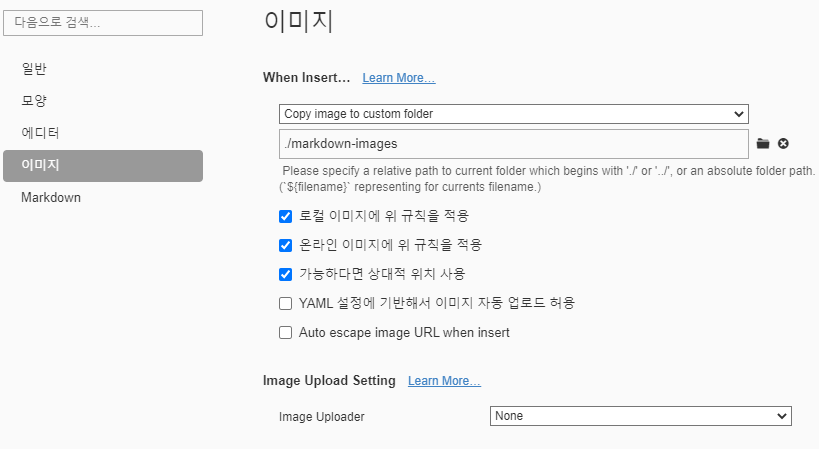

# 마크다운 문법 

## 제목(heading)

제목은 `#` 로 표현 가능하다. `H1`~`H6`까지 표현 가능하다.

### 제목 3

#### 제목 4

##### 제목 5

###### 제목 6

## 목록

* 목록은

* 순서가 없는 목록이

* 있다.

  * 탭을 통해 목록 수준을 표현할 수 있다.
  * 엔터

  엔터

* 엔터

1. 순서가 있는 목록도

2. 있다.

   1. 엔터를 누르고 *를 하면

   * 섞어서 쓸 수도 있다.

## 코드 블록

```python
print('hello!')
# 이것은 주석입니다.
```

```html
<!-- 주석 -->
# 주석 아님
<h1>
    안녕
</h1>
```

## 링크

외부 URL : [google](http://google.com)

특정 파일의 상대 경로 : [README](./README.md)

## 이미지 파일


* 위와 같이 절대경로로 표현하면, GitHub 등에서 파일이 존재하지 않아 이미지가 제대로 출력되지 않는다.
* 따라서, typora에 다음과 같은 설정을 해보자



## 표

본문 -> 표 -> 표 삽입

| 이름   | 나이 | 비고 |
| ------ | ---- | ---- |
| 홍길동 | 300  |      |
| 김철수 | 10   |      |

## 기타 문법

*기울임 이택릭체*

**굵게 볼드체**

`인라인코드블록`

~~취소선~~

